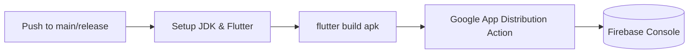

# 🚀 ProdTrack CI/CD - Firebase App Distribution Integration Guide

This guide describes how to connect your **ProdTrack** Flutter application to **GitHub Actions** and **Fastlane** to build and distribute Android releases directly to your testers in **Firebase App Distribution**.

We have provided **both** methods:
1. **Direct Firebase CLI (Google Action)**: Recommended for fast, lightweight CI workflows without Ruby version management.
2. **Fastlane Pipeline**: Excellent for advanced builds, multi-platform releases, and running deployments locally on your developer workstation.

---

## 🔑 Part 1: Provision Google Service Account Key

Google recommends using **Service Accounts** instead of legacy Firebase Login Tokens for authenticating CI/CD pipelines.

1. Go to the [Google Cloud Console](https://console.cloud.google.com/) and select your Firebase Project.
2. Navigate to **IAM & Admin > Service Accounts**.
3. Click **Create Service Account**:
   * **Name**: `prodtrack-firebase-ci`
   * **Role**: Assign the **Firebase App Distribution Admin** role (this limits access exclusively to App Distribution uploads for maximum security).
4. Click on the newly created Service Account, go to the **Keys** tab, and click **Add Key > Create New Key**.
5. Select **JSON** format, click **Create**, and save the file. It contains your private service credentials!

---

## 🔒 Part 2: Configure GitHub Secrets

To make the workflow operational, add the following parameters in your GitHub Repository under **Settings > Secrets and Variables > Actions > New repository secret**:

| Secret Name | Value Example / Description |
| :--- | :--- |
| `FIREBASE_APP_ID` | Your Firebase App ID (e.g. `1:1234567890:android:abcd1234efgh`). Found in **Project Settings** in the Firebase Console. |
| `CREDENTIAL_FILE_CONTENT` | The **entire contents** of your downloaded Service Account JSON key file. Copy and paste the whole block directly. |
| `FIREBASE_TOKEN` | *(Optional Fallback)* A Firebase Login Token generated via `firebase login:ci`. Only required if you choose not to use the Service Account JSON method. |

---

## 🛠️ Part 3: Deploying via Direct Firebase CLI

The direct CLI deployment is configured inside **Job A** of [`.github/workflows/firebase_app_distribution.yml`](file:///.github/workflows/firebase_app_distribution.yml).

### Workflow Sequence


* **Triggers**: Runs automatically when pushes occur on the `main` or `release` branches.
* **Manual Execution**: Go to the **Actions** tab in your GitHub repository, select **ProdTrack CI/CD**, and click **Run workflow**.

---

## 🏎️ Part 4: Deploying via Fastlane

Fastlane allows you to package and distribute your Android builds either inside GitHub Actions or directly from your local terminal.

### 1. File Structure Overview
*   **[`android/Gemfile`](file:///android/Gemfile)**: Registers the local Fastlane Ruby version.
*   **[`android/fastlane/Pluginfile`](file:///android/fastlane/Pluginfile)**: Registers the official Firebase App Distribution plugin.
*   **[`android/fastlane/Appfile`](file:///android/fastlane/Appfile)**: Holds application metadata configuration.
*   **[`android/fastlane/Fastfile`](file:///android/fastlane/Fastfile)**: Implements the `:distribute_to_firebase` lane.

### 2. Run Fastlane locally on your computer
Ensure you have Ruby installed on your computer, then execute the following inside the `/android` directory:

```bash
# 1. Install bundler and fastlane dependencies
bundle install

# 2. Compile your Flutter APK (from the root workspace directory)
flutter build apk --release

# 3. Deploy to Firebase using your local service credentials key
# (Specify your Firebase App ID and the path to your service account key file)
export FIREBASE_APP_ID="your-firebase-app-id-here"
export GOOGLE_APPLICATION_CREDENTIALS="path/to/your/service-account-key.json"

bundle exec fastlane android distribute_to_firebase
```

### 3. Run Fastlane inside GitHub Actions
This is configured inside **Job B** (`deploy_via_fastlane`) in [`.github/workflows/firebase_app_distribution.yml`](file:///.github/workflows/firebase_app_distribution.yml). It dynamically captures your GitHub Repository secrets, writes a secure ephemeral JSON file on the CI node, and uploads the APK automatically.
